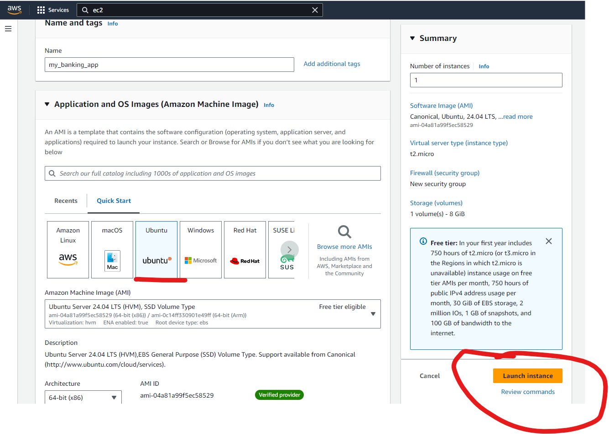
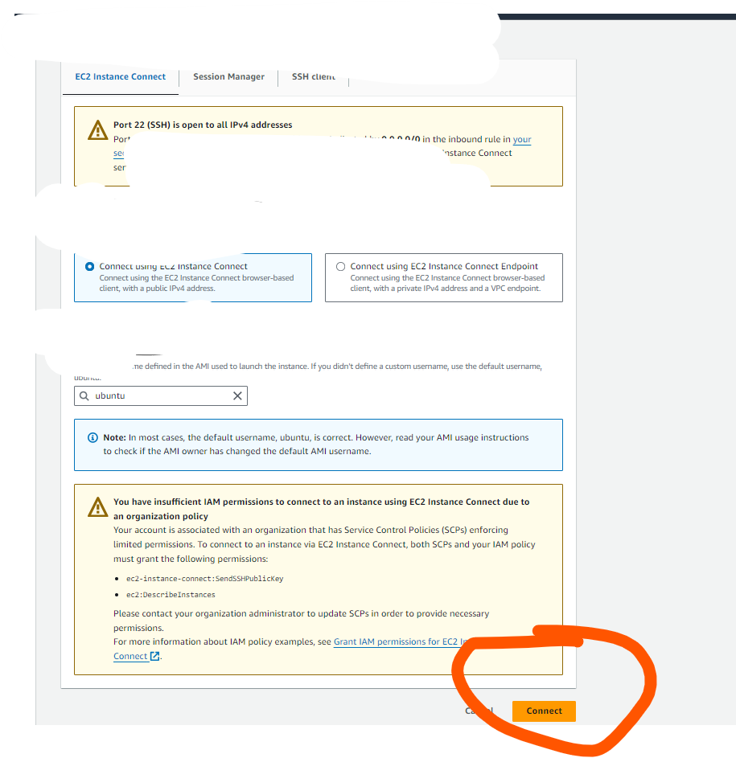
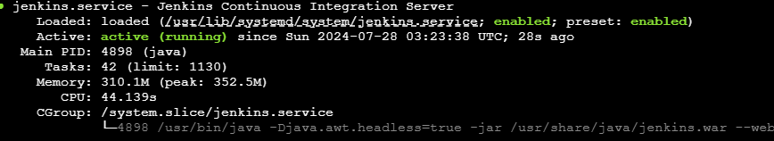
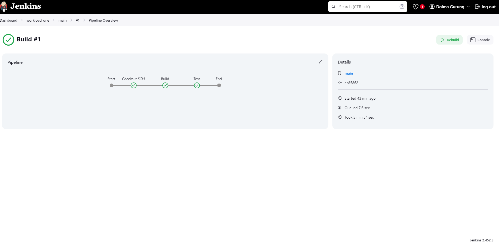
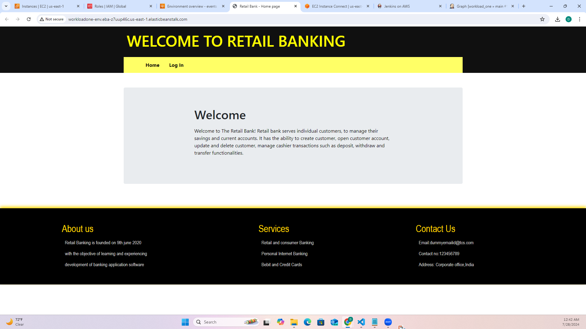

# Kura Labs Cohort 5- Deployment Workload 1
## Intro to CI/CD

## Table Of Contents

- [PURPOSE](#purpose)
- [STEPS And Why each was Necessary](#the-steps-taken-and-why-each-was-necessaryimportant)
- [SYSTEM DESIGN DIAGRAM](#system-design-diagram)
- [ISSUES and TROUBLESHOOTING](#issuestroubleshooting)
- [OPTIMIZATION](#optimization)
- [CONCLUSION](#conclusion)

### PURPOSE

The purpose of the workload was to learn how we can utilize the CICD pipeline to run different stages such as build and test. We can utilize this method in the future to deploy applications. We also learned how to utilize AWS managed service "Elastic Beanstalk" to quickly deploy application in a few simple steps.


### The "STEPS" taken (and why each was necessary/important)


1. ### <u> This step was necessary to copy the code into our github. Using fork would be faster but it will show that the code has been take from the Kura Labs account and this method helps to make sure that the code is owned by us. </u>

Using git to clone the project repo into local and pushing it to personal github

```
git clone https://github.com/kura-labs-org/C5-Deployment-Workload-1.git

```
Create a new empty folder on your desktop

Copy all the contents of the repo: C5-Deployment-Workload-1 that we cloned

Open the folder using VS Code or any other IDE

Run the following Commands in the terminal of your IDE: 

```
git init
git add .
git commit -m "Added all workload files"
```

Create a new repository in GitHub, name it my_banking_app and run the following commands in your local folder. These will push your code from local to GitHub

```
git remote add origin https://github.com/dolmagrg123/my_banking_app.git
git branch -M main
git push -u origin main

```


2. ### <u>This step is required so that we can use EC2 server to run Jenkins on.</u>

Launch a new EC2 using Ubuntu and use t2.micro as it is free tier eligible.




3. ### <u>This steps helps to install and run Jenkins on the EC2 server. We can use this steps in the future when we want to deploy our application using Jenkins.</u>

Install Jenkins onto the EC2

	a. Connect to the EC2 terminal



 	b. Enter the following commands to install Jenkins:

```
    $sudo apt update && sudo apt install fontconfig openjdk-17-jre software-properties-common && sudo add-apt-repository ppa:deadsnakes/ppa && sudo apt install python3.7 python3.7-venv
    $sudo wget -O /usr/share/keyrings/jenkins-keyring.asc https://pkg.jenkins.io/debian-stable/jenkins.io-2023.key
    $echo "deb [signed-by=/usr/share/keyrings/jenkins-keyring.asc]" https://pkg.jenkins.io/debian-stable binary/ | sudo tee /etc/apt/sources.list.d/jenkins.list > /dev/null
    $sudo apt-get update
    $sudo apt-get install jenkins
    $sudo systemctl start jenkins
    $sudo systemctl status jenkins

```

If successful, the last command should show the Jenkins service “active (running)”





4. ### <u>Creating an admin user helps us to login every time we want to use Jenkins in the future.</u>

To login to jenkins use the publicIPv4 address of the EC2 where you installed jenkins and paste it in the browser with port 8080.


	a. Enter initial admin password : you can find the password in /var/jenkins_home/secrets/
    
    ```
    cat /var/jenkins_home/secrets/initialAdminPassword
    ```

	b. Install suggested plugins

	c. Create first admin user


5. ### <u> In this step we are creating Jenkins pipeline and connecting it to our GitHub. This is necessary Jenkins will require permissions to deploy our code from GitHub</u>
 Create a Multi-Branch pipeline

	a. Click on “New Item” in the menu on the left of the page

	b. Enter a name for your pipeline
  
    c. Select “Multibranch Pipeline”
  
    d. Under “Branch Sources”, click “Add source” and select “GitHub”
  
    e. Click “+ Add” and select “Jenkins”
  
    f. Make sure “Kind” reads “Username and password”

    g. Under “Username”, enter your GitHub username

    h. Under “Password” ,enter your GitHub personal access token

To get the GitHub personal access token, first log into GitHub and click on your profile icon on the top right of the page.

i. On the dropdown menu, click on “Settings”

ii. Click on “<> Developer settings at the bottom of the menu on the left of the page

iii. Click on “Personal access tokens” on the menu on the left of the page and select “Tokens (classic)”

iv. Click “Generate new token” and select the classic option

v. Set an expiration date and then select the following "scopes": repo, admin:repo_hook

This token can only be viewed ONCE! Make sure you enter the token properly (or save it) before leaving the page otherwise a new token must be generated!


6. ### <u> This step was to point the Jenkins pipeline to our GitHub Repo which has the code that need to be deployed. </u>

Connect GitHub repository to Jenkins

	a. Enter the repository HTTPS URL and click "Validate"
  
	b. Make sure that the "Build Configuration" section says "Mode: by Jenkinsfile" and "Script Path: Jenkinsfile"
  
	c. Click "Save" and a build should start automatically




7. ### <u> In this step we were able to quickly use AWS managed service Elastic Beanstalk to quickly deploy our application </u>

Download the contents of the repository and upload a zip file of the application it to AWS Elastic Beanstalk.
  
	a. First, follow the instructions in this [LINK](https://scribehow.com/shared/How_to_Create_an_AWS_IAM_Role_for_Elastic_Beanstalk_and_EC2__kTg4B7zRRxCp-aYTJc-WLg) for "How to Create an AWS IAM Role for Elastic Beanstalk and EC2" and create the two IAM roles as specified.

    b. Navigate to the AWS Elastic Beanstalk console page

    c. Navigate to the "Environments" page on the left side menu and click on "Create Environment"

    d. Create a "Web server environment" and enter the an Application name (Environment name should auto populate after that)

    e. Choose "Python 3.7" as the "Managed platform"

    f. "Upload your code" by choosing a "local file" and select the zipped application files you created earlier.

    g. Under "Presets", make sure that "Single instance (free tier eligible) is selected and then click "Next"

    h. Select the "Service role" and "EC2 profile" in the appropriate drop down menus and then click "Next"

    i. Select the default VPC and Subnet "us-east-1a" and then click "Next"

    j. Select "General Purpose (SSD) for "Root volume type" and assign it 10 GB.

    k. Ensure that "Single instance" is selected for the "Environment type" and that ONLY "t3.micro" is selected for instance types (remove all others if present) and then click "Next"

    l. Select 'BASIC' health reporting under the monitoring section. NOT "ENHANCED"!

    m. Continue to the "Review" page and then click "Submit".

    n. When the "environment is successfully launched", click on the link provided in the "Domain" and confirm that the application has deployed!




### "SYSTEM DESIGN DIAGRAM"
	
### "ISSUES/TROUBLESHOOTING"

While Deploying the application using elastic beanstalk, we got an error of 502 bad gateway. Upon looking at the code that was uploaded in the Elastic Beanstalk, we realized the zipped file downloaded from github has a parent folder. So we zipped it again with only the files and reuploaded it to beanstalk and the application ran successfully.

I had initally created a develop branch in my GitHub and when I tried to deploy the code, the EC2 crashed and I was unable to restart. I terminated the EC2 and created a new EC2. I also deleted the develop branch and only deployed the main branch and it ran successfully.

### "OPTIMIZATION'

Using managed services like elastic beanstalk can be very helpful to companies that do not have a large team. AWS takes care of scalibility, security and reliability of the application so that the developers can focus on the functional aspect of the software.

Even though AWS manages the security of the application, it is upto the client to make sure their data is secure. AWS shared responsibility model defines that AWS takes care of the Security of the Cloud and Customer needs to take care of the Security in the Cloud. We can resolve it by encrypting data that are confidential and by properly following the security standards. 

Other issues might be less control over infrastructure as we only deploy our code but AWS takes control of the complete infrastructure. We can resolve it by using providers that allow to work closely in discussing infrastructure options.

To resolve such issues we can also use custom scripts/Infrastructure as Code tools like Terraform to quickly deploy our application which gives complete control over the application.


	
## "CONCLUSION"

In a nutshell, this workload gave hands on practice to deploy a live application with few steps. We also learned about managed services in AWS and their advantages as well as disadvantage which was very beneficial.	

